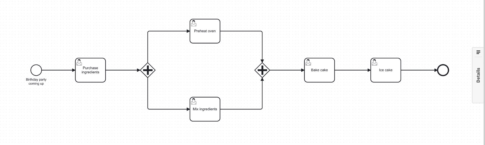
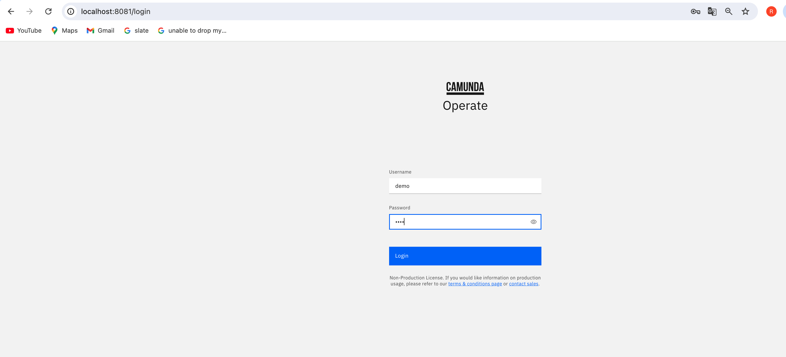
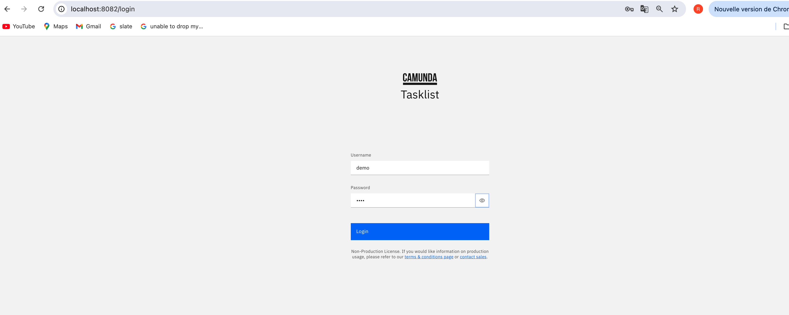

 

## Introduction
Camunda 8 is a modern platform for business process automation. It's designed to meet the demands of scalable, distributed systems and microservices architectures. See https://docs.camunda.io/docs/guides/ for more information. 

Camunda 8 consist of a set of components: 
- **Zeebe** : the process engine responsible for executing workflows.
- **Tasklist** : it's a component used for managing user tasks (that requires humain intervention).
- **Operate** : Operate component that allow developers and operators to track the progress of process instance, troubleshoot issues and optimize performance.
- **Optimize** : used for improving processes by identifying constraints in the system.
- **Web modeler** : It's a tool usedd for process modeling (available only for enterprise customer). We will use his Desktop version (**Desktop modeler**) available at https://camunda.com/download/modeler/ 

In this article, we will discuss how to setup a development environment for Camunda 8 using the official helm charts. 

## Prerequisites

- Kubernetes basics
- Setup a Kubernetes (k8s) cluster on your local machine. Yo can install **Docker desktop** (https://www.docker.com/products/docker-desktop/) on your system, then activate Kubernetes cluster (a docker desktop feature)
- Helm. Visit https://helm.sh/docs/intro/install/ and follow the installation instructions.
## Installation

1. Add the Camunda 8 helm repository

```shell
helm repo add camunda https://helm/camunda.io
helm repo update
```

2. Get an edit the Camunda 8 helm chart values based on your cluster capacity.

```shell
curl -o values.yaml https://raw.githubusercontent.com/camunda/camunda-platform-helm/main/kind/camunda-platform-core-kind-values.yaml
```

The command above downloads the default values file into your current diirectory. Here is its content.

```yaml
global:
  identity:
    auth:
      # Disable the Identity authentication for local development
      # it will fall back to basic-auth: demo/demo as default user
      enabled: false

# Disable identity as part of the Camunda core
identity:
  enabled: false

# Disable keycloak
identityKeycloak:
  enabled: false

optimize:
  enabled: false

# Reduce for Zeebe and Gateway the configured replicas and with that the required resources
# to get it running locally
zeebe:
  clusterSize: 1
  partitionCount: 1
  replicationFactor: 1
  pvcSize: 10Gi

zeebeGateway:
  replicas: 1

connectors:
  enabled: true
  inbound:
    mode: disabled

elasticsearch:
  master:
    replicaCount: 1
    # Request smaller persistent volumes.
    persistence:
      size: 15Gi
```

We can adjust the values accordingly to our requirements(system memory, TLS, Ingress, etc.). See https://artifacthub.io/packages/helm/camunda/camunda-platform#parameters

1. Deploy Camunda component using the `values.yaml` file downloaded previously.

```
helm install camunda8 camunda/camunda-platform -f values.yaml
```

Helm will automatically deploy the docker images of all camunda components on our cluster. The corresponding pods may take some time to start depending on the system capacity.

Execute `kubectl get pods` to check pods status.

```
NAME                                      READY   STATUS    RESTARTS        AGE
camunda8-connectors-86498765d8-bvm9w      1/1     Running   0               11m
camunda8-elasticsearch-master-0           1/1     Running   0               11m
camunda8-operate-7c6f6d54df-fvrb8         1/1     Running   2 (4m55s ago)   11m
camunda8-tasklist-7b89bd57d9-jnwzr        1/1     Running   1 (3m49s ago)   11m
camunda8-zeebe-0                          1/1     Running   0               11m
camunda8-zeebe-gateway-75f9d55f45-csgft   1/1     Running   0               11m
web-57f46db77f-qvpm9
```
NB. For development purposes, we don't need to install all of camunda component. 
## Connecting to our camunda 8 component

Now our camunda component are accessible only inside the cluster. To make them accessible from outside, we will simply use port forwarding. Port forwarding allow us to route traffic from our local machine to k8s cluster,

### Connecting to Zeebe (the workflow engine)

The command below allow us to interact with zeebe from outside of cluster.

```
kubectl port-forward svc/camunda8-zeebe-gateway 26500:26500 -n default
kubectl port-forward svc/camunda8-zeebe-gateway 8088:8080 -n default
```

### Connecting to Operate

```
kubectl port-forward svc/camunda8-operate  8081:80
```
Then, open browser to http://localhost:8081. Use demo/demo to login

 

### Connecting to Tasklist

```
kubectl port-forward svc/camunda8-tasklist 8082:80
```
Then, open browser to http://localhost:8082

 

```
kubectl port-forward svc/camunda8-connectors 8086:8080
```

NB: `helm status camunda8` give the overview of the deployment with port-forward command.

With Camunda 8 up and running in our kubernetes, we are now ready to design, deploy and manage scalable business processess, leveraging the powerful features of both platforms to build robust and efficient solutions.